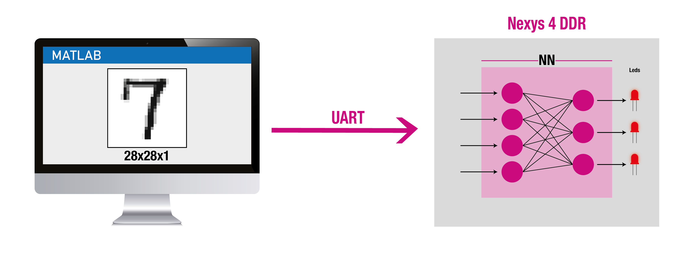
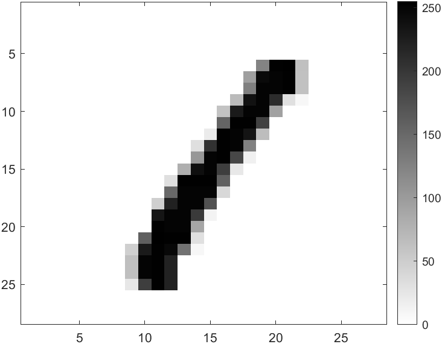
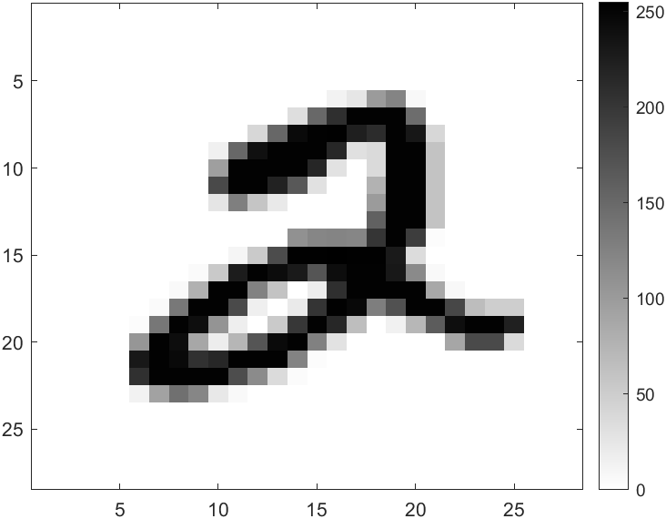
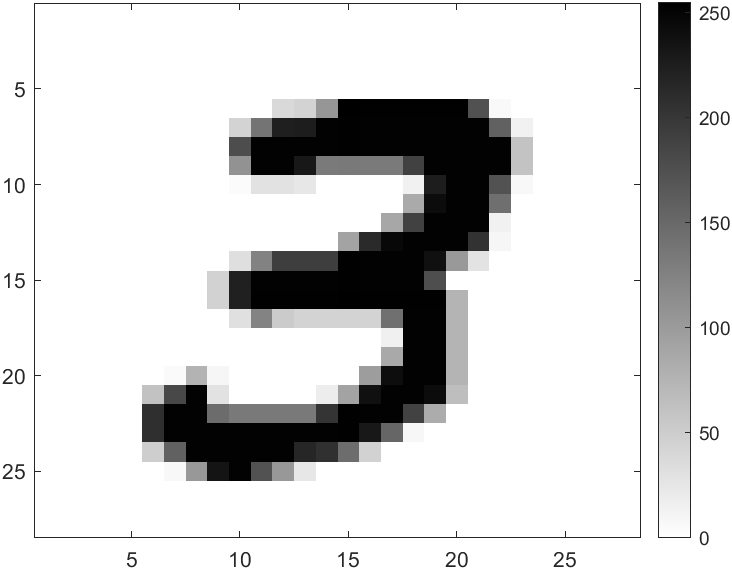

# Implementación de rede perceptrón en VHDL

Guía para a realización e implementación dunha rede perceptrón na placa de desenvolvemento Nexys 4 DDR para a identificación e clasificación de números escritos a man.

Utilízase o coñecido conxunto de datos MNIST, un estándar no mundo da aprendizaxe automática para a clasificación de díxitos manuscritos. O modelo escollido é unha rede de perceptróns, a estrutura neuronal máis fundamental, cunha arquitectura que conta con 784 entradas e 10 neuronas na capa de saída, correspondentes a cada díxito do 0 ao 9.

Entón, tal e como se comentaba ao inicio do apartado, o obxectivo deste caso práctico é enviar imaxes de díxitos dende o ordenador á FPGA para que esta realice a clasificación do número. O número que considere que representa a imaxe verase reflexado na batería de leds da FPGA. Un esquema xeral do que se levará a cabo móstrase na Figura 1.

  
  
<b>1: Esquema xeral da aplicación</b>

## Hardware e Ferramentas Utilizadas

- **Nexys 4 DDR**: O hardware seleccionado é a placa de desenvolvemento Nexys 4 DDR, que incorpora una FPGA Artix 7.
- **MATLAB**: Utilizase o software MATLAB para adestrar a rede perceptrón e obter os seus pesos.
- **Vivado**: A implementación hardware da rede é programada en VHDL mediante Vivado.

## Puntos a tratas

A división dos puntos será a seguinte:

1. **Data Set.** Formateo dos datos de partida.
2. **Adestramento do Perceptrón.** Definición do modelo, adestramento e obtención dos pesos de cada neurona.
3. **Deseño hardware do Perceptrón.** Deseño e simulación en VHDL.
4. **Deseño hardware da rede.** Excalar o Perceptrón ata obter as dez neuronas para a identificación do díxito.
5. **Deseño da unidade de comunicación.** Comunicación do ordenador coa FPGA para o envio das imaxes mediante protocolo UART.
6. **Implementación final e validación funcional da rede.**

Por último, comentar que non se trata de realizar un clasificador no que a precisión sexa cercana ao 100%, se non de verificar, mediante un exemplo simple, que se pode levar a cabo un sistema intelixente que implique a utilización da FPGA.

## 1. Data Set

Os datos de partida obteñense da base de datos MNIST ([http://yann.lecun.com/exdb/mnist/](http://yann.lecun.com/exdb/mnist/)), considerada o "hola mundo" do aprendizaxe automático. Consta de 70.000 "imaxes" de díxitos numéricos escritos a man, en escala de grises e cunhas dimensións de 28x28x1 píxeles. Cada un dos 784 píxeles que conforman unha "imaxe" conteñen 8 bits de información. Na Figura 1.1 represéntanse tres díxitos coa escala de cores á súa esquerda, onde cada píxel pode tomar 256 valores distintos, comezando co 0 para os píxeles brancos e finalizando no 255 para o negro puro.

    
    
    

<b>1.1: Representacións dos datos</b>

    

    <b>Representación do nº 1</b> <b>Representación do nº 2</b> <b>Representación do nº 3</b>

    

        
         
        <b>Representación do nº 1</b>
    

    

        
         
        <b>Representación do nº 2</b>
    

    

        
         
        <b>Representación do nº 3</b>
    

As 70.00 mil móstras están divididas en dous grupos, 60.000 exemplos para o conxunto de adestramento e 10.000 para o conxunto de proba. Na seguinte Táboa 1.1, listanse os arquivos obtidos da base de datos MNIST:

| Nome do arquivo             | Mostras | Tipo    | Conxunto              |
|-----------------------------|---------|---------|-----------------------|
| train-images-idx3-ubyte.gz  | 60 000  | dato    | conxunto de adestramento |
| train-labels-idx1-ubyte.gz  | 60 000  | etiqueta| conxunto de adestramento |
| t10k-images-idx3-ubyte.gz   | 10 000  | dato    | conxunto de proba     |
| t10k-labels-idx1-ubyte.gz   | 10 000  | etiqueta| conxunto de proba     |

