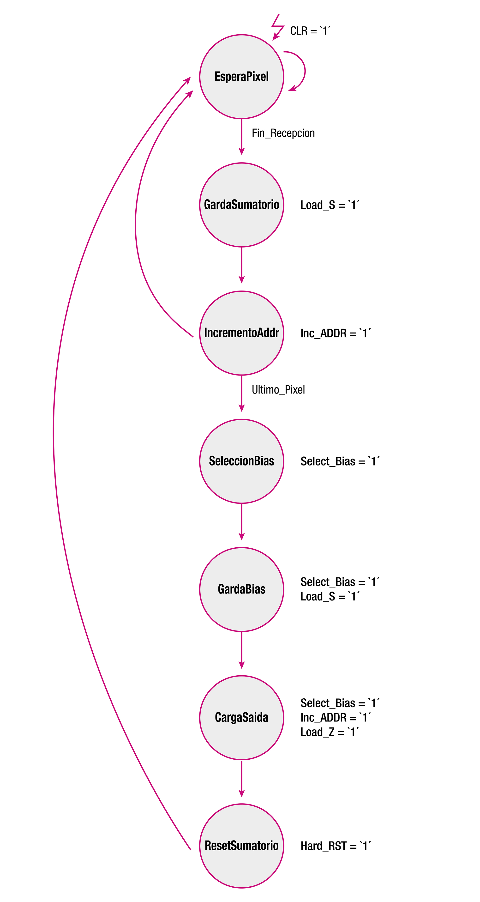
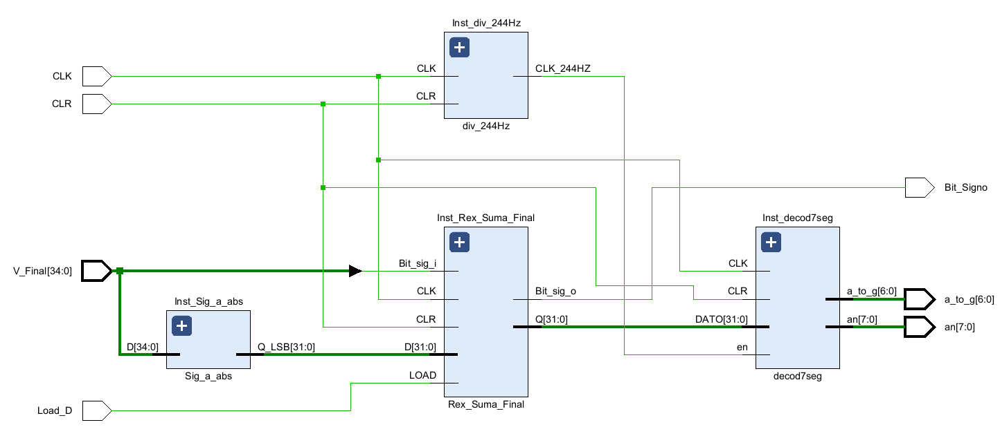

# Implementación de rede perceptrón en VHDL

Guía para a realización e implementación dunha rede perceptrón na placa de desenvolvemento Nexys 4 DDR para a identificación e clasificación de números escritos a man.

Utilízase o coñecido conxunto de datos MNIST, un estándar no mundo da aprendizaxe automática para a clasificación de díxitos manuscritos. O modelo escollido é unha rede de perceptróns, a estrutura neuronal máis fundamental, cunha arquitectura que conta con 784 entradas e 10 neuronas na capa de saída, correspondentes a cada díxito do 0 ao 9.

Entón, tal e como se comentaba ao inicio do apartado, o obxectivo deste caso práctico é enviar imaxes de díxitos dende o ordenador á FPGA para que esta realice a clasificación do número. O número que considere que representa a imaxe verase reflexado na batería de leds da FPGA. Un esquema xeral do que se levará a cabo móstrase na Figura 1.

  
  
<b>Figura 1: Esquema xeral da aplicación</b>

## Hardware e Ferramentas Utilizadas

- **Nexys 4 DDR**: O hardware seleccionado é a placa de desenvolvemento Nexys 4 DDR, que incorpora una FPGA Artix 7.
- **MATLAB**: Utilizase o software MATLAB para adestrar a rede perceptrón e obter os seus pesos.
- **Vivado**: A implementación hardware da rede é programada en VHDL mediante Vivado.

## Puntos a tratas

A división dos puntos será a seguinte:

1. **Data Set.** Formateo dos datos de partida.
2. **Adestramento do Perceptrón.** Definición do modelo, adestramento e obtención dos pesos de cada neurona.
3. **Deseño hardware do Perceptrón.** Deseño e simulación en VHDL.
4. **Deseño hardware da rede.** Excalar o Perceptrón ata obter as dez neuronas para a identificación do díxito.
5. **Deseño da unidade de comunicación.** Comunicación do ordenador coa FPGA para o envio das imaxes mediante protocolo UART.
6. **Implementación final e validación funcional da rede.**

Por último, comentar que non se trata de realizar un clasificador no que a precisión sexa cercana ao 100%, se non de verificar, mediante un exemplo simple, que se pode levar a cabo un sistema intelixente que implique a utilización da FPGA.

## 1. Data Set

Os datos de partida obteñense da base de datos MNIST ([http://yann.lecun.com/exdb/mnist/](http://yann.lecun.com/exdb/mnist/)), considerada o "hola mundo" do aprendizaxe automático. Consta de 70.000 "imaxes" de díxitos numéricos escritos a man, en escala de grises e cunhas dimensións de 28x28x1 píxeles. Cada un dos 784 píxeles que conforman unha "imaxe" conteñen 8 bits de información. Na Figura 1.1 represéntanse tres díxitos coa escala de cores á súa esquerda, onde cada píxel pode tomar 256 valores distintos, comezando co 0 para os píxeles brancos e finalizando no 255 para o negro puro.

    
    
    

<b>Figura 1.1: Representacións dos datos</b>

As 70.00 mil móstras están divididas en dous grupos, 60.000 exemplos para o conxunto de adestramento e 10.000 para o conxunto de proba. Na seguinte Táboa 1.1, listanse os arquivos obtidos da base de datos MNIST:

  
  
<b>Táboa 1.1: Arquivos base de datos MNIST</b>

Antes de comezar a traballar cos datos de partida é necesario cargalos no Workspace de MATLAB e darlle formato. Mediante o código [a_formateado_dataset](/Codigo_MATLAB/scripts/a_formateado_dataset.m) os arquivos descargados son descomprimidos e reformateados en matrices multidimensionais de MATLAB obtendo a seguinte estructura:

- Datos → nº de filas x nº de columnas x nº de mostras
- Etiquetas → nº de etiquetas x nº de filas

## 2. Adestramento do perceptrón

O adestramento da rede para a identificación dos díxitos realizase en MATLAB. Para elo é necesario ter instalado a librería Deep Learning Toolbox.

O problema proposto non ten unha solución lineal, é dicir, non é posible separar o conxunto de datos con unha única linea ou plano, polo que coas características propias dun perceptrón non é posible obter unha solución para a clasificación de tódolos datos nun número finito de iteracións. Esto débese en esencia á función de activación implementada polo perceptrón, de tipo lineal. 

Aumentar o número de neuronas e capas ocultas pode axudar a diminuir o erro, pero o feito de utilizar a función de activación lineal en tódalas neuronas é o limitante para dar coa solución.

Se ben é certo que para obter un bo resultado no recoñecemento de patróns recoméndanse outro tipo de redes neuronais, para maior simplicidade á hora de implementar a rede en VHDL usarase unha rede perceptrón.

A Figura  2.1 corresponde cunha rede de perceptróns que contén unha única capa de S neuronas perceptronas conectadas a R entradas a través dun conxunto de pesos w_{i,j}.  Os índices de rede i e j indican que w_{i,j} é a forza (peso) da conexión dende a entrada j-ésima á neurona i-ésima.

  
  
<b>Figura 2.1: Rede Perceptrón</b>

### 2.1 Acondicionamento dos datos

Partindo do punto anterior e sabendo que cada unha das imáxenes confórmana 784 píxeles con 8 bits/píxel de información plantéxase utilizar cada un dos píxeles como entrada á rede. O número de neuronas da capa de saída será de 10, cada unha delas identificará un dos díxitos, do 0 ao 9.

O paso previo ao adestramento da rede é acondicionar os datos conforme ao descrito na documentación da función train de MATLAB. A sección 1 do código [b_rede_perceptron](/Codigo_MATLAB/scripts/b_rede_perceptron.m) realiza o seguinte cambio nas matrices de datos:

- XTrain (28x28x60000) → DatosA (784x60000).
- YTrain (60000x1) → EtiquetasA (10x60000).
- XTest (28x28x10000) → DatosT (784x10000).
- YTest (10000x1) → EtiquetasT (10x10000).

De este modo, as matrices de datos resultantes estarán dispostas de maneira que cada unha das imaxes conformarana tódolas filas (píxeles) dunha columna e a correspondente etiqueta estará na mesma columna da matriz de etiquetas. A saída correspondente da matriz de etiquetas está activa con un 1. Na Figura 2.2 represéntase á esquerda a matriz de imaxes e á dereita a matriz de etiquetas.

    
    

<b>Figura 2.2: Matriz dos datos</b>

A maiores realízase un normalizado dos datos para facer unha comparativa da precisión da rede adestrada cos datos normalizados e sen normalizar.

A normalización é un paso importante no preprocesamento de datos para moitos algoritmos de aprendizaxe automática e, en particular, as redes neuronais. Cando se trata de imáxes con píxeles que conteñen valores entre o 0 eo 255 o que se fai é dividir cada un destes píxeles por 255, de este modo limítase o rango a [0, 1]. Xeralmente, co adestramento de datos normalizados, os resultados son máis precisos.

### 2.2 Adestramento do Perceptrón e obtención dos pesos

Mediante sección 2 do código [b_rede_perceptron](/Codigo_MATLAB/scripts/b_rede_perceptron.m)  realízase o adestramento de dúas redes, unha cos entradas normalizadas e outra sen normalizar. A exactitude da rede adestrada con datos sen normalizar alcanza o 77.04%, mentres que o valor obtido cos datos normalizados é do 86.18%, o que supon unha mellor de 8.78 puntos porcentuais. Aínda que é unha ganancia sustancial, utilizar datos normalizados supón traballar con decimais e polo tanto transformar todo a coma fixa. Neste caso, e para simplificar o sistema, traballarase con datos enteiros, xa que o obxetivo non é alcanzar o resultado máis óptimo.

Os resultados da clasificación cos datos de test móstranse na matriz de confusión da Figura 2.3 Una nota de interese é o número 10 en realidade fai referencia ao díxito 0. Ademáis, é importante considerar que os datos de test non están balanceados, tal e como se ve na Figura 2.4, polo que a escala de cores non é de todo fiable. Igualmente, observase con claridade como o perceptrón ten maiores problemas para clasificar o número  8, clasificando o 9 como 8, 221 veces e o 0 como 8 ata 100 veces. A causa é clara, a similitude na disposición dos píxeles que conforman os díxitos.

  
  
<b>Figura 2.3: Matríz de confusión</b>

  
  
<b>Figura 2.4: Número de mostras por etiqueta</b>

Mediante o algorito de adestramento obteñense os pesos da rede para 10 iteracións. Tóda a información xerada durante o adestramento do perceptrón está contida no obxeto *rede*.

A matriz de pesos *pesos_rede* e *pesos_bias* son obtidas da *rede* mediante as primeiras lineas da sección 5 do código [b_rede_perceptron](/Codigo_MATLAB/scripts/b_rede_perceptron.m). Por unha banda, a matriz *pesos_rede* contén tódolos pesos correspondentes ás conexións das 784 entradas coas 10 neuronas e a matriz *pesos_bias* os correspondentes as bias de cada una das neuronas. Os valores obtidos son números enteiros con signo, polo tanto, ao non conter números decimais, non habrá pérdida de información no momento da conversión a formato binario para xerar as memorias.

### 2.3 Xeración do arquivo .COE

Para implementar as memorias de pesos é necesario coñecer o número de bits do seu contido. Para isto, extráese o valor máximo en valor absoluto dos pesos, e contabilízase o número de bits necesarios para a súa representación. Ao traballar con números con signo sumarase un máis ao valor obtido para a representación en complemento a dous.

Tendo en conta que a optimización de recursos é intrínseco nunha FPGA, a utilización de buses de datos da menor dimensión posible na memorias de pesos diminuirá significativamente o uso de recursos inecesarios. Esto cobra maior sentido no apartado no cal se calcula o número de bits necesarios en cada unha das operacións do algoritmo do perceptrón.

Unha maneira de solventar esto e traballar con datos de punto fixo con signo e sen parte decimal. De este modo, poderase representar tódolos valores co número de bits que conveña.

Neste caso en concreto, os número máximo e mínimo en decimal son 21347 e -33252 respectivamente. En valor absoluto, o número maior é o 33252, polo que serán necesarios 17 bits para representalo en complemento a dous.

O IP Core usado para almacenar os pesos é o ``Block Memory Generator'', o cal admite inicialización da memoria mediante un arquivo de coeficientes de memoria (COE). O arquivo COE especifica o contido de cada ubicación de memoria. Este formato de arquivo para inicializar as memorias ven definido na documentación do fabricante da FPGA ([https://docs.xilinx.com/v/u/en-US/pg058-blk-mem-gen](https://docs.xilinx.com/v/u/en-US/pg058-blk-mem-gen)).

Un COE é un arquivo de texto que especifica dous parámetros.

- **memory_initialization_radix**: O valor do formato de almacenamento dos datos. As opcións son 2, 10 ou 16. Neste caso traballarase con números en binario, primeira opción.
- **memory_initialization_vector**: Define o contido de cada celda da memoria. Estes coeficientes poden ir separados por un espazo, unha coma ou colocando un valor en cada liña con un salto de liña.

Baseándose no formato especificado, a sección 6 do código [b_rede_perceptron](/Codigo_MATLAB/scripts/b_rede_perceptron.m) realiza os cálculos para obter o número de bits necesarios para representar tódolos números en Ca2 e xera de forma automática tódolos arquivos .COE para cada unha das memorias de pesos das neuronas. En total son 10 arquivos, un por neurona, con 785 pesos, incluíndo o bias.

O resultado é o da Figura 2.5, no cal o texto iníciase co encabezado citado e cada número separado por comas é o contido desa posición de memoria. Pódese ver como as primeiras posicións, ata chegar á novena, están a cero. Esto significa que os píxeles desas posicións non aportan información valiosa.

  
  
<b>Figura 2.5: Arquivo COE de memoria</b>

## 3. Deseño hardware do perceptrón

Tomando a neurona como a entidade básica dunha rede neuronal, e partindo do modelo matemático desta, plantéxanse os bloques:

- **Bloque multiplicador:** Multiplica cada píxel de entrada polo seu correspondente peso, almaceado na memoria ROM.
- **Bloque sumador acumulador:** Suma os resultados da operación de multiplicación co sumatorio acumulado ata o momento.
- **Bloque función de activación:** Función de activación mediante limiar.

Estes tres bloques xuntos conforman a unidade operativa da neurona.

  
  
<b>Figura 3.1: Esquema do perceptrón</b>

### 3.1 Bloque multiplicador

Este bloque é o encargado de multiplicar o valor de cada píxel polo correspondente peso. Trabállase con números enteiros con signo polo que o problema simplificase sustancialmente.

Hai dúas entradas ao bloque, por un lado está a saída da memoria ROM que almacea tódolos pesos correspondentes á súa neurona, e polo outro a entrada dos datos/píxeles. É importante recordar que cada ROM almacéa os pesos da identificación de un díxito, e debe asignarse á neurona cuxa saída esperada é a identificación de ese mesmo díxito.

#### 3.1.1 Entrada de datos

O valor pertencente a cada píxel recibirase bit a bit de menos significativo a máis significativo (No apartado de comunicación explicarase o proceso de transmisión dos datos). Unha vez se complete a trama de 8 bits é necesario realizar unha extensión de signo. Isto é necesario xa que a multiplicación pode conter números negativos procedentes dos pesos da ROM.

Como xa se mencionou, na ROM tamén está almaceado o peso da entrada bias. A entrada bias, tamén chamada sesgo, ten un valor de un en tódolos casos (a entrada, non o valor correspondente ao seu peso), polo que é necesario agregar un multiplexor que incorpore esa entrada ao multiplicador. A multiplicación do bias polo seu peso realízase en último lugar (o peso bias está na posición 784 da memoria ROM).

#### 3.1.1 Entrada de pesos

A segunda entrada ao bloque multiplicador é a saída da memoria ROM. Incórporase unha memoria ROM de tipo "Single-port ROM" a través do "Block Memory Generator".

Para que a latencia sexa a mínima, un ciclo de reloxo dende un cambio na entrada de direccionamento, non se incorporan rexistros de saída na "Memory Core" nin na "Memory Primitives". Igualmente, o bloque de memoria estará sempre activo (EN = '1'), simplificando a tarea de control da memoria. As posibles configuracións e características veñen definidas na documentación ([https://docs.xilinx.com/v/u/en-US/pg058-blk-mem-gen](https://docs.xilinx.com/v/u/en-US/pg058-blk-mem-gen)).

A maiores impleméntase un contador ascendente que recorrerá tódalas direccións da memoria ROM. Este contador comezará en 0 e reiniciarase en 784 (785 posicións, as primeiras 784 corresponden cos pesos dos píxeles e a última posición ao peso do bias). Este incremento no contador farase despois da recepción de cada píxel ("Fin_Recepcion") e unha vez rexistrada a saída da operación do sumatorio ("Load_S") Figura 3.2. Ademáis da saída de direccionamento, engádese unha saída indicativa de que a dirección apunta ao último peso de píxel, de este modo, dende a unidade de control podrase realizar o control do multiplexor para o cambio á entrada do valor bias.

  
  
<b>Figura 3.2: Timing activación do incremento ADDR memoria ROM</b>

Nota: 2. GardaSumatorio, 3. IncrementoAddr

#### Cálculo de bits do módulo

Como xa se mencionou, cada píxel ten un tamaño de 8 bits, que coa extensión de signo aumentaría a 9 bits. A outra entrada ao multiplicador son os pesos con un tamaño de 17 bits, polo que a saída do multiplicador, no caso extremo, terá un máximo de 26 bits, que comprende valores entre -33554432 a 33554431.

### 3.2 Bloque Sumador acumulador

Este bloque é o encargado de realizar a suma da entrada ponderada actual coa suma acumulada das anteriores entradas ponderadas. Para implementar este proceso necesítanse dous bloques, un sumador con dúas entradas e un rexistro á saída do sumador. O rexistro actuará como almacén do sumatorio acumulado e a súa saída volvería á segunda entrada do sumador, realimentando o bloque. O control da carga do valor na saída do rexistro manipularase dende a unidade de control.

#### Cálculo de bits do módulo

Para o cálculo de bits necesarios da saída do sumatorio teranse en conta os valores máximos de cada un dos sinais involucrados. Entón o valor máximo a representar en valor absoluto ven dado pola seguinte ecuación:

  

Redondeando ao maior o resultado anterior, obteñense 34 bits para representar o valor máximo. Contando que o número represéntase en Ca2 son necesarios un total de 35 bits.

### 3.3 Bloque función de activación

O último bloque antes de pasar á unidade de control da neurona é a función de activación. A función de activación é de tipo lineal e funciona mediante un limiar, ao superar este, a saída actívase. No caso da función de activación "hardlim" o limiar é 0, polo que se a súa entrada é igual ou maior a 0 obterase un 1 á saída, en caso contrario, produce un 0.

Para manter visible o resultado obtido pola neurona, e para que este non varíe durante tódolos cálculos intermedios, incorporase un rexistro no bit de saída, concretamente un biestable. De este modo só se activará o rexistro de saída cando se procesen tódalas entradas e non se reseteará ata unha nova clasificación.

### 3.4 Unidade Operativa Neurona

Na Figura 3.3 represéntanse tódolos bloques que conforman a unidade operativa da neurona e o seu interconexionado. Os sinais de entrada a este bloque, exceptuando o sinal de reloxo "CLK" e de reset "CLR", son as referidas ás entradas de control dos diferentes elementos. Todos estes sinais de mando son dirixidas dende a Unidade de Control, que se explicará en detalle no seguinte apartado.

  
  
<b>Figura 3.3: Bloques unidade operativa da neurona</b>

### 3.5 Unidade de Control Neurona

A unidade de uontrol da neurona é a encargada de realizar o control dos bloques da Unidade Operativa xestionando os tempos. É unha máquina de estados que se recorre secuencialmente polas etapas da Figura 3.4 e realiza diferentes accións.

  
  
<b>Figura 3.4: Diagrama de estados Unidade de Control da neurona</b>

- **EsperaPixel:** Estado inicial de espera. Neste estado realizase a espera da trama dos 8 bits do píxel procedente do módulo de comunicación explicado no apartado anterior. A entrada *Fin_Recepcion*, procedente do bloque de comunicación, indica se a transmisión dos bits que conforman o píxel están dispoñibles para poder ser utilizados. Se este sinal está activo pásase ao seguinte estado.

- **GardaSumatorio:** Esta etapa xestiona a carga do rexistro encargado de acumular o sumatorio. O sinal involucrado é *Load_S*. É necesario que as operacións de multiplicación e suma se leven a cabo antes de realizar a carga no rexistro do valor de saída do sumador. Para esta operación hai un marxe de 40 ns, o tempo transcurrido entre o acceso ao píxel de entrada e a carga no rexistro. Unha vez acumulado o valor do sumatorio, pásase á seguinte etapa ou estado.

- **IncrementoAddr:** Ten lugar a activación do sinal de control *Inc_ADDR*, habilitando o incremento do contador ascendente da dirección de memoria ROM. De este modo a entrada de pesos do multiplicador actualizase e queda a espera da chegada do novo valor do píxel. O contador tamén dispón dunha saída de disparo, chamada *Ultimo_pixel*, a cal indica que o contador alcanzou o valor 783. Unha vez alcanzado este valor, logo de pasar polos tres estados mencionados 783 veces, repítese o ciclo unha última vez antes de pasar ao estado seguinte.

- **SeleccionBias:** Actívase o sinal *Select_Bias* para escoller no multiplexor o valor do bias en lugar da entrada do píxel. Tras un ciclo de reloxo pásase á etapa seguinte.

- **GardaBias:** Mantén activo o *Select_Bias* e tamén o habilita *Load_S* para realizar a carga do valor do bias polo seu peso no rexistro do sumatorio.

- **CargaSaida:** Unha vez completadas tódalas operacións, neste estado actívase o rexistro de saída da función de activación *Load_Z* e de novo incrementase o contador de direccionamento da ROM para forzar o seu reseteo. No caso de que o díxito a identificar sexa o que corresponde a esta neurona, a saída *Activación* porase a nivel alto.

- **ResetSumatorio:** Por último, antes de volver ao inicio, nesta fase restablécese o rexistro encargado de gardar o valor do sumatorio.

### 3.6 Comprobación do funcionamento

Neste apartado comprobarase mediante un test bench o correcto funcionamento da neurona. Para elo instanciase unha memoria tipo ROM obtida directamente dos exemplos do "Lenguages Template" de Vivado. Na ROM insertaranse mediante código tódolos píxeles dunha das imaxes pertencentes ao conxunto de proba. 

Para obter de forma rápida os valores de cada un dos píxeles que conforman a imaxe seleccionada realízase a sección 1 do código [d_probas_funcionais](/Codigo_MATLAB/scripts/d_probas_funcionais.m). De este modo imprímense por pantalla os valores, en formato hexadecimal, de cada un dos píxeles. O conxunto de datos cópiase no módulo creado en VHDL para realizar o test bench. Deste xeito inicialízanse tódolas direccións de memoria do módulo ROM externo cun caso real, simulando a entrada dos píxeles na rede.

O seguinte paso para a comprobación das operacións da neurona é realizar unha matriz en MATLAB na cal se van a almacean tódolos valores que toman os bloques de  multiplicación e sumatorio a medida que se incrementan as direccións de memoria. O algoritmo da sección 2 do código [d_probas_funcionais](/Codigo_MATLAB/scripts/d_probas_funcionais.m) xera unha matriz de 2x785 no cal a fila un toma os valores da saída do multiplicador e a fila dous a saída do sumatorio.

Na simulación da Figura 3.5 obsérvanse os saltos entre os estados comentados no apartado anterior e as activacións das saídas correspondentes. Esta captura da simulación mostra a carga e procesado do último píxel máis o valor de bias.

  
  
<b>Figura 3.5: Simulación funcional da neurona</b>

O ciclo completo é o seguinte: Partindo do estado de espera (1) *EsperaPixel*, coa chegada dun novo píxel actívase o sinal *Fin_Recepcion*, saltando ao estado (2). Xa en *GardaSumatorio* actívase a carga no rexistro do sumatorio *Load_S*, pero como se observa na figura, o valor do peso do píxel 784 (a dirección da memoria é un menos) é 0, ao igual que o píxel. Esto tradúcese en que o valor do sumatorio acumulado non varíe. No estado (3), *IncrementoAddr* auméntase a dirección de memoria e ao estar activo *Ultimo_Pixel*, salta a (4) *SeleccionBias* rompendo o bucle. Aquí simplemente cambia o multiplexor seleccionando o sinal de bias como entrada, que ten un valor de 1. O cambio do valor da salida da ROM, *Pesos*, tarda un ciclo de reloxo en efectuarse dende que se incrementou a dirección de memoria da mesma. Prácticamente de forma instantánea obtense o resultado da multiplicación ao inicio do estado (5) *GardaBias*. É neste estado donde se orixina o a última carga do rexistro da suma acumulada, marcada coa barra vertical vermella. Logo, en (6) *CargaSaida* rexistrase o valor de saída da función de activación da neurona. Como xa se dixo, este valor será 1 en caso de obter un número positivo no rexistro da suma. Vese como o número é negativo e a saída da neurona é cero *Activacion*. Por último, en (7) *ResetSumatorio*, límpase o rexistro acumulatorio e volve ao incio.

Pódese comprobar ademáis como o último valor alcanzado pola entrada á función de activación *S_acumulada* é -12294803, que corresponde co valor final alcanzado nas operacións realizadas en MATLAB mencionado anteriormente. De este modo verificase o correcto funcionamento do código realizado.

  
  
<b>Figura 3.6: Comprobación do valor final do rexistro da suma acumulada</b>

## 4. Deseño hardware da rede
Partindo da neurona tipo Perceptrón creada, de forma paralela, implementaranse dez neuronas na capa de saída de maneira que se poidan clasificar os dez posibles díxitos de entrada activando a saída correspondente.

Como os bytes de cada píxel da imaxe veñen secuencialmente, o problema de conexionado simplificase significativamente, xa que só é necesario interconexionar cada unha das neuronas co rexistro de saída do píxel. De este modo o sistema sería o representado na Figura 4.1.

  
  
<b>Figura 4.1: Rede perceptrón</b>

Hai certos elementos que se poden utilizar para tódalas neuronas. A unidade de control é común, xa que a secuencia das etapas lévase a cabo en tódalas neuronas. Outro elemento que non é necesario reproducir é o multiplexor encargado de cambiar a entrada do píxel pola do bias. Polo tanto, todos os demáis elementos que conforman a neurona é necesario instancialos 10 veces. No caso das memorias ROMs de pesos, hai que realizar o procedemento indicado no apartado da creación da memoria ROM e cargar en cada unha o arquivo COE correspondente.

## 5. Deseño da unidade de comunicación

s imaxes pertencentes ao conxunto de proba están almaceadas no ordenador polo que é necesario envialas á FPGA para obter a clasificación desta. Só é necesario o envío dos datos dende o ordenador, polo que a comunicación será nunha única dirección (Comunicación Simplex).
O protocolo designado para este caso é o UART, Universal Asynchronous Receiver-Transmitter, o cal utilizarase para o envío dos 784 píxeles que conforman unha imaxe.

A placa de desenrolo Nexys 4 DDR inclúe o integrado FTDI FT2232HQ, encargado de realizar unha ponte USB-UART entre o conector Micro-USB e os pin encargados da comunicación UART na FPGA.

  
  
<b>Figura 5.1: Conexionado entre FT2232HQ e Artix-7</b>

A comunicación realizase a través dun porto serie de dous fíos, un deles é o TXD, o fío transmisor e outro é o RXD, o receptor. Neste caso o fluxo de datos vai ser sempre dende o ordenador á FPGA simplificando a transmisión a un só fío, a linea RXD. Ao tratarse dun protocolo serie asíncrono é necesario que os dispositivos involucrados traballen (en relación a comunicación) á mesma velocidade, neste caso será a 115200 baudios.

A trama empregada é a coñecida como 8N1, a cal contén un bit de start, 8 bits de datos, ningún bit de paridade, e un bit de parada. A secuencia que se realiza é a seguinte:

1. En primer lugar, o sinal RXD encóntrase a nivel alto. No momento no cal se pon a nivel baixo (bit de Start) comeza a transmisión.
2. Ao bit de start síguenlle os 8 bits do dato, bit a bit, comezando polo menos significativo. É neste momento, unha vez transcurrida a metade do ciclo, cando se garda o bit na FPGA.
3. Por último, o sinal RXD ponse a nivel alto, bit de stop, para indicar que a comunicación finalizou.

  
  
<b>Figura 5.2: Secuencia de transmisión mediante protocolo UART</b>

Para realizar o descrito creouse o módulo *TOP_UART_Recepcion*. Cada un dos submódulos que conforman este bloque describense brevemente a continuación.

### 5.1 Unidade Operativa do módulo UART

A unidade Operativa do módulo UART conformano os bloques da Figura 5.3 Cada un deles realiza as seguintes tarefas:

- **Detector_flanco:** Como o seu nome indica, é un detector de flanco descendente. Cando o sinal RXD comeza a caer a cero, a saída do detector de flanco establécese en un durante un ciclo de reloxo (identificación do bit de start). Esta entrada na máquina de estado é a que inicializa o bloque.

- **Cont_ciclos:** É o contador encargado de realizar o cómputo do número de ciclos de reloxo entre a transmisión de cada un dos bits da trama. Na metade da transmisión actívase a saída *MetadePulso*, utilizada para gardar o valor do bit.

- **Rex_desprazamento:** Rexistro de desprazamento que vai almaceando, bit a bit (de menos a máis significativo), o valor do dato. A activación da carga do novo bit prodúcese despois de darse un pulso no sinal *MetadePulso*.

- **Contador:** Contador ascendente que se incrementa cada vez que se garda un novo bit. Cando o contador chega a 7 realizase un último gardado e dase por finalizada a recepción dos 8 bits.

- **Rexistro_saida_UART:** Rexistro de almacenamento do dato (píxel) de entrada. Unha vez obtidos os 8 bits no rexistro de desplazamento, estes son volcados neste rexistro, listos pra ser utilizados.

  
  
<b>Figura 5.3: Unidade Operativa do módulo UART</b>

### 5.2 Unidade de Control do módulo UART

Este módulo implementa a máquina de estados que realiza o control dos módulos da unidade operativa. A Figura 5.4 representa os diferentes estados e as accións que se levan a cabo en cada un.

  
  
<b>Figura 5.4: Unidade de Control do módulo UART</b>

- **EsperaInicio:** Neste estado agárdase por un flanco de baixada do sinal RXD, indicativo do inicio da transmisión. É o único dos estados onde o contador de ciclos está deshabilitado (EN = 0) e o sinal *RST_cont* a 1, este último é un reset síncrono do contador de ciclos.

- **BitStart:** Unha vez detectado o bit de inicio, espérase medio pulso, (8.68/2 μs). A activación de *MetadePulso* indica esta transición. Neste paso, simplemente faise un atraso para posicionarse correctamente e así adquirir os bits con seguridade.

- **EsperaBit:** É similar ao estado anterior, coa diferenza de que os novos bit xa son o contido do dato e non bits de control da comunicación. Unha vez activo *MetadePulso* pásase ao seguinte paso.

- **GardaBit:** Este estado encárgase de gardar o bit entrante e introducilo no rexistro de desprazamento. Unha vez gardado o bit, volvería ao estado anterior esperando outro pulso. Este ciclo repítese 8 veces.

- **CargaSaida:** Unha vez adquiridos os 8 bits que forman un dos píxeles, actívase o sinal de control *LoadSaida* e volcase o byte do rexistro de desprazamento ao de saída.

- **Fin:** Indícase que o byte foi recibido e xa está listo para ser tratado nas seguintes etapas.

### 5.3 Envío de datos dende o ordenador

Para o envío dos datos dende o ordenador utilízase o entorno de Matlab. O código [c_script_envio_mensaxe_uart](/Codigo_MATLAB/scripts/c_script_envio_mensaxe_uart.m) é o encargado da comunicación. Hai que considerar o cambio da variable *Port* en función do porto USB do ordenado ao que se conecte a FPGA. 

Coa variable *imaxe* seleccionase una das 10 000 mostras para ser enviadas a través do porto serie.

## 6 Implementación final e funcionamento

Para realizar a implementación final é necesario ter un modo de testear que tódalas operacións levadas a cabo pola FPGA fanse correctamente. En primer lugar, establécese unha conexión entre a batería de leds e as saídas de cada neurona, correspondendo cada un dos leds, do 0 ao 9, cos díxitos a identificar. A maiores, para visualizar que as operacións internas son as correctas, implementase un módulo para representar no display de 7 segmentos os resultados das multiplicacións.

### 6.1 Implementación de display

O módulo ten por obxectivo visualizar o resultado final obtido no rexistro de almacenamento da suma acumulada. Con este valor e co código [d_probas_funcionais](/Codigo_MATLAB/scripts/d_probas_funcionais.m), pódese realizar una comparativa e testear o funcionamento.

Para levar a cabo esta labor son imprescindibles os catro módulos da Firgura 6.1.

  
  
<b>Figura 6.1: Bloque display</b>

- **decod7seg:** Contén o código para a xestión da representación dos díxitos.
- **div_244Hz:** Divisor de frecuencia necesario para visualizar os díxitos do display de maneira fixa, sen parpadeos. Con tasas de refresco elevadas, o ollo humano non percibe as transicións entre o apagado e encendido dos leds.
- **Sig_a_abs:** Obtén o valor absoluto do número de entrada e extrae os 32 bits menos significativos. Isto é porque o bus de entrada ao decodificador é dun máximo de 32 bits. En realidad, eliminar os 3 bits menos significativos non cambiará nada na inmensa maioría dos casos, xa que o dimensionamento dos vectores está pensado para casos extremos nos que os valores de entrada son o máximo e os pesos tamén.
- **Rex_Suma_Final:** É o rexistro do valor final obtido nas operacións de multiplicación e suma. Podríase decir que é unha extensión do rexistro da suma acumulada, so que unha vez finalizadas as operacións, este non se resetea. So cambia de valor cando se sobreescribe. O bit de signo tamén é rexistrado, e no caso de ser un número negativo encenderase o LD15 da placa.

A maiores, engadiuse un multiplexor para seleccionar que saída dos rexistros da suma acumulada querse visualizar. Na táboa mostranse as configuracións:

  
  
<b>Táboa 6.1: Selector visualización display</b>

### 6.2 Comprobación do funcionamento da implementación final

Una vez conectada a Nexys 4 ao ordenador mediante un conector USB e cargado o bitstream síguense os seguintes pasos para comprobar o funcionamento:

1. Selección do sumatorio acumulado seguindo a táboa mencionada anteriormente.
2. Configuración do porto COM no script de MATLAB mencionado anteriormente, selección da imaxe e execución do código.
3. Na sección 2 do código [d_probas_funcionais](/Codigo_MATLAB/scripts/d_probas_funcionais.m) cambiar o valor de *numero* pola neurona seleccionada cos switches e modificar *imaxe* co número de mostra que se enviou á FPGA e executar.
4. Verificar a concordancia entre os datos.

No caso de querer seleccionar outra saída é necesario volver a facer o ciclo anterior.

Para o exemplo da Figura 6.2, seleccionouse a mostra 2 do conxunto de datos de test, que neste caso corresponde co díxito 2. Nas imaxes pode verse como o led LD2 está acendido, o que significa que a clasificación foi levada con éxito. Na imaxe da esquerda pode identificarse o bit de signo da saída da neurna seleccionada, a 0, e o número ``FCE95C'' en hexadecimal. Que o número sexa negativo é bo sinal, pero para confirmar que tódolos cálculos son correctos necesítase a saída real desta mesma neurona. A sección 2 do código [d_probas_funcionais](/Codigo_MATLAB/scripts/d_probas_funcionais.m) proporciona dúas matrices cos valores reais das operacións de multiplicación e sumatorio para cada una das 785 iteracións. O resultado da matríz de MATLAB *Mult_sum_hex* é exactamente o mesmo que o marcado polo display, confirmando a boa execución do perceptrón na FPGA.

    
    

<b>Figura 6.2: Resultados da impplementación física da imaxe 2</b>

